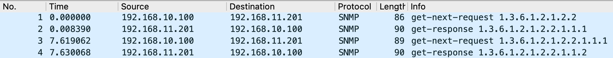
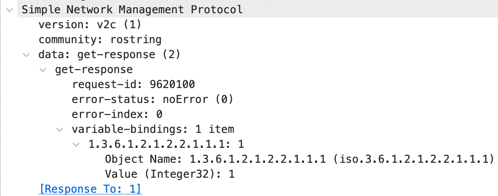
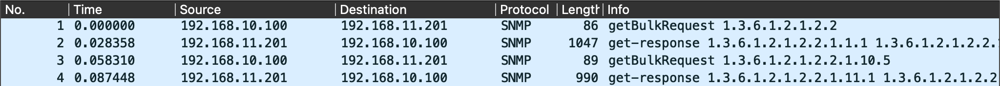
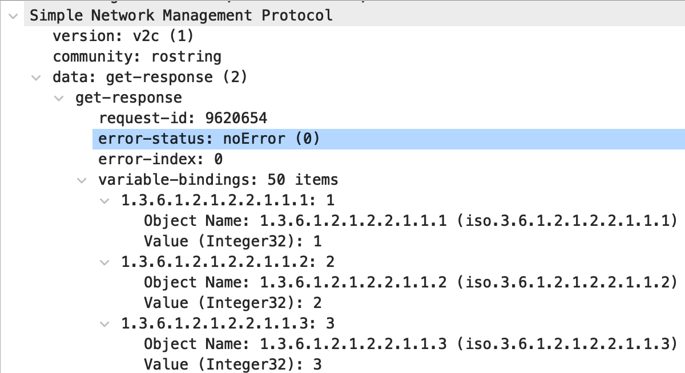

---
date:
  created: 2022-01-16
  updated: 2025-05-23
categories:
  - Automation
tags:
  - Python
  - Automation
  - SNMP
links:
  - PySNMP Project: https://github.com/lextudio/pysnmp
  - posts/2021-08-25-snmp-queries-with-python.md
  - posts/2022-01-11-pysnmp-hlapi-overview.md
  - posts/2022-01-14-compiling-mibs-for-pysnmp.md
  - posts/2022-01-16-bulk-data-gathering-with-pysnmp.md
  - posts/2022-01-19-secure-query-with-snmpv3-and-pysnmp.md
  - posts/2022-03-02-parse-pysnmp-object-names.md
---

# Bulk Data Gathering with PySNMP nextCmd and bulkCmd

Up until now my articles ([PySNMP HLAPI](2022-01-11-pysnmp-hlapi-overview.md), [Compiling MIB's for PySNMP](2022-01-14-compiling-mibs-for-pysnmp.md)) have focused on using simple SNMP GET requests with PySNMP's [getCmd](https://pysnmp.readthedocs.io/en/latest/docs/hlapi/v3arch/asyncore/sync/manager/cmdgen/getcmd.html). This works great for simple SNMP queries where you only need one piece of information. When performing gathering of larger data sets with SNMP, issuing single SNMP GET requests for each data point can be very inefficient. Often times you are limited by the latency that exists between the SNMP manager (your script/code) and the SNMP agent running on a network device. In this article we will explore PySNMP's implementation of SNMP GET NEXT and GET BULK using the [nextCmd](https://pysnmp.readthedocs.io/en/latest/docs/hlapi/v3arch/asyncore/sync/manager/cmdgen/nextcmd.html) and [bulkCmd](https://pysnmp.readthedocs.io/en/latest/docs/hlapi/v3arch/asyncore/sync/manager/cmdgen/bulkcmd.html) command generators and how to retrieve the ifTable table of data from an SNMP agent.

<!-- more -->

!!! note
    The historical [pysnmp](https://github.com/etingof/pysnmp) project, which has not been maintained due the the unfortunate passing of the maintainer, has since been [forked](https://github.com/lextudio/pysnmp) and is being actively maintained (disclaimer, I have yet to test it yet). Most links in my SNMP posts to the PySNMP readthedocs should automatically redirect to the latest documentation, but the technical nature of my posts has not yet been updated. I hope to update these posts so that the community has a good resource to reference for the updated package.

## What is ifTable?

[ifTable](http://www.net-snmp.org/docs/mibs/interfaces.html) is an SNMP table that represents the interfaces on a remote device (a Cisco router in this article) and meta-data associated with the interfaces. Each column of the table represents meta-data such as:

- ifDescr - the description of the interface
- ifType - the type of interface
- ifMtu - the MTU of the interface
- ifSpeed - the speed of the interface
- ifPhysAddress - the MAC address of the interface (in the case of ethernet)
- ifAdminStatus - the administrative status (e.g. up/down) of the interface
- ifOperStatus - the operational status (e.g up/down/testing/unknown/notPresent, etc) of the interface
- ifInOctets/ifOutOctets - the input and output octets on the interface
- ifInErrors/ifOutErrors - the input and output errors on the interface
- Many more! (refer to the ifTable link above for a complete list)

Each row of the table represents an interface on the device and is represented by an ifIndex integer value per interface. For example, ifIndex value of 1 is used for the interface with a description of GigabitEthernet0/0, a value of 2 for GigabitEthernet0/1, and so on.

For devices with many interfaces (e.g. a modular or stacked switch), there can be several hundred interfaces with corresponding ifIndex values. You can imagine that querying each one of these interfaces with a SNMP GET request you will be issuing one request per interface per type of meta-data you wish to collect.

## SNMP GETNEXT Requests with PySNMP nextCmd()

When we used PySNMP's getCmd() function in a ([previous article](2022-01-11-pysnmp-hlapi-overview.md) you were expected to provide a MIB name, variable name, and an integer value representing an instance (`ObjectIdentity('SNMPv2-MIB', 'sysName', 0)`). In some cases this works fine, but in the case of our ifTable example, how are we to know the instance number representing each case? This would mean establishing ObjectIdentity instances for each ifIndex value thats available, but often times we won't know about these ahead of time. We can instead send an SNMP GETNEXT request which allows us to query for data where we may not know this index value, as well as get related sequential data.

An SNMP GETNEXT command means that we query for a particular MIB variable instance and the SNMP agent on the remote device will respond not an answer for the OID in the request, but with the OID and value for the _next_ variable in the MIB tree. This works well when querying a table where we may not know what the starting instance index is, because we can start with the MIB variable of the table itself (e.g. ifTable by specifying a PySNMP ObjectType of `ObjectType(ObjectIdentity('IF-MIB', 'ifTable'))`) and the SNMP avent on the remote device responds with the next available variable in the MIB tree.

To explain this behavior further refer to the below image.


In the above example we can see the following:

- In packet 1 an SNMP GETNEXT query was issued for OID 1.3.6.1.2.1.2.2 which was sent using `ObjectType(ObjectIdentity('IF-MIB', 'ifTable'))`
- In packet 2 an SNMP get-response of 1.3.6.1.2.1.2.2.1.1.1 was returned which when reviewing the response PySNMP ObjectType instance it is for `IF-MIB::ifIndex.1 = 1`. This is the first entry underneath ifTable which indicates that there is an index instance of 1 for ifIndex.1
- In packet 3 an SNMP GETNEXT query was issued for OID 1.3.6.1.2.1.2.2.1.1.1. This at first might seem odd, because its actually the OID that was returned in packet 2. But this is the behavior of SNMP GETNEXT requests; a response packet tells the SNMP manager (your code) what to query next
- In packet 4, instead of returning the value of OID 1.3.6.1.2.1.2.2.1.1.1 it is returning the **next** value of 1.3.6.1.2.1.2.2.1.1.2 which when translated is `IF-MIB::ifIndex.2 = 2`

Details of packet 2, the first SNMP GETNEXT response, can be seen in the below screenshot. Looking at the variable-bindings, you can see that there is no binding for the OID of 1.3.6.1.2.1.2.2 (ifTable), but instead a single binding of the next variable in the MIB tree; 1.3.6.1.2.1.2.2.1.1.1 (ifIndex.1).



To perform an SNMP GETNEXT query with PySNMP and walk an the ifTable, we build our command generator using nextCmd() as follows:

```python
iterator = nextCmd(
    SnmpEngine(),
    CommunityData('rostring', mpModel=1),
    UdpTransportTarget(('192.168.11.201', 161)),
    ContextData(),
    ObjectType(ObjectIdentity('IF-MIB', 'ifTable')),
    lexicographicMode=False
)
```

The majority of the code above has been well explained in my [PySNMP HLAPI](2022-01-11-pysnmp-hlapi-overview.md) post and are very similar to that of the getCmd() command. The two differences are:

- We're now using nextCmd() instead of getCmd()
- An option of `lexicographicMod=False` is included

`lexicographicMode=False` is an option that by default is True. What this means is that by default (value=True) we can use the command generator with next() to query from the particular ObjectIdentity that we provided all the way until the end of the MIB. When the end of the MIB is reached a PySNMP StopIteration exception is thrown which we can catch with a try/except clause. When we provide a value of False, this means that PySNMP will return values only within the current heirarchy of what we initially requested. In the example code above, with `lexicographicMode=False`, we only want to query descendants of ifTable and nothing outside of that tree thats further below in the MIB.

To walk the entire ifTable using the nextCmd() command generator shown above, we can loop over the command generator until the StopIteration exception is thrown:

```python
MAX_REPS = 500
count = 0
while(count < MAX_REPS):
    try:
        errorIndication, errorStatus, errorIndex, varBinds = next(iterator)
        print(varBinds[0].prettyPrint())
    except StopIteration:
        break

    count += 1
```

!!! warning
    I previously wrote the above while() look at a while(True) loop, which probably isn't great. This can result in an infinite loop if the logic within the loop doesn't have a guaranteed break-away. This would normally be the StopIteration exception being seen, but I have now written a fail-safe with an arbitrarily set MAX_REPS value of 500 and a count variable that increments after each loop.

Running the above code will result in all varBind variables being printed to screen. It is within this while() loop that you would perform additional handling of the SNMP responses such as storing them in a database, writing them to file, taking action based a response, etc. Running the code above will generate a large number of printed statements showing the entire ifTable contents:

```
IF-MIB::ifIndex.1 = 1
IF-MIB::ifIndex.2 = 2
IF-MIB::ifIndex.3 = 3
IF-MIB::ifIndex.4 = 4
IF-MIB::ifIndex.5 = 5
IF-MIB::ifDescr.1 = GigabitEthernet0/0
IF-MIB::ifDescr.2 = GigabitEthernet0/1
IF-MIB::ifDescr.3 = GigabitEthernet0/2
IF-MIB::ifDescr.4 = GigabitEthernet0/3
IF-MIB::ifDescr.5 = Null0
IF-MIB::ifType.1 = ethernetCsmacd
IF-MIB::ifType.2 = ethernetCsmacd
IF-MIB::ifType.3 = ethernetCsmacd
IF-MIB::ifType.4 = ethernetCsmacd
IF-MIB::ifType.5 = other
IF-MIB::ifMtu.1 = 1500
IF-MIB::ifMtu.2 = 1500
IF-MIB::ifMtu.3 = 1500
IF-MIB::ifMtu.4 = 1500
IF-MIB::ifMtu.5 = 1500
IF-MIB::ifSpeed.1 = 1000000000
IF-MIB::ifSpeed.2 = 1000000000
IF-MIB::ifSpeed.3 = 1000000000
IF-MIB::ifSpeed.4 = 1000000000
IF-MIB::ifSpeed.5 = 4294967295
IF-MIB::ifPhysAddress.1 = 52:54:00:17:10:3e
IF-MIB::ifPhysAddress.2 = 52:54:00:17:0b:b4
IF-MIB::ifPhysAddress.3 = 52:54:00:09:5f:73
IF-MIB::ifPhysAddress.4 = 52:54:00:04:4d:73
IF-MIB::ifPhysAddress.5 =
IF-MIB::ifAdminStatus.1 = up
IF-MIB::ifAdminStatus.2 = down
IF-MIB::ifAdminStatus.3 = down
IF-MIB::ifAdminStatus.4 = down
IF-MIB::ifAdminStatus.5 = up
IF-MIB::ifOperStatus.1 = up
IF-MIB::ifOperStatus.2 = down
IF-MIB::ifOperStatus.3 = down
IF-MIB::ifOperStatus.4 = down
IF-MIB::ifOperStatus.5 = up
IF-MIB::ifLastChange.1 = 2633
IF-MIB::ifLastChange.2 = 3010
IF-MIB::ifLastChange.3 = 3032
IF-MIB::ifLastChange.4 = 3032
IF-MIB::ifLastChange.5 = 0
IF-MIB::ifInOctets.1 = 114294
IF-MIB::ifInOctets.2 = 0
IF-MIB::ifInOctets.3 = 0
IF-MIB::ifInOctets.4 = 0
IF-MIB::ifInOctets.5 = 0
IF-MIB::ifInUcastPkts.1 = 1266
IF-MIB::ifInUcastPkts.2 = 0
IF-MIB::ifInUcastPkts.3 = 0
IF-MIB::ifInUcastPkts.4 = 0
IF-MIB::ifInUcastPkts.5 = 0
IF-MIB::ifInDiscards.1 = 0
IF-MIB::ifInDiscards.2 = 0
IF-MIB::ifInDiscards.3 = 0
IF-MIB::ifInDiscards.4 = 0
IF-MIB::ifInDiscards.5 = 0
IF-MIB::ifInErrors.1 = 0
IF-MIB::ifInErrors.2 = 0
IF-MIB::ifInErrors.3 = 0
IF-MIB::ifInErrors.4 = 0
IF-MIB::ifInErrors.5 = 0
IF-MIB::ifInUnknownProtos.1 = 0
IF-MIB::ifInUnknownProtos.2 = 0
IF-MIB::ifInUnknownProtos.3 = 0
IF-MIB::ifInUnknownProtos.4 = 0
IF-MIB::ifInUnknownProtos.5 = 0
IF-MIB::ifOutOctets.1 = 9820093
IF-MIB::ifOutOctets.2 = 0
IF-MIB::ifOutOctets.3 = 0
IF-MIB::ifOutOctets.4 = 0
IF-MIB::ifOutOctets.5 = 0
IF-MIB::ifOutUcastPkts.1 = 84803
IF-MIB::ifOutUcastPkts.2 = 0
IF-MIB::ifOutUcastPkts.3 = 0
IF-MIB::ifOutUcastPkts.4 = 0
IF-MIB::ifOutUcastPkts.5 = 0
IF-MIB::ifOutDiscards.1 = 0
IF-MIB::ifOutDiscards.2 = 0
IF-MIB::ifOutDiscards.3 = 0
IF-MIB::ifOutDiscards.4 = 0
IF-MIB::ifOutDiscards.5 = 0
IF-MIB::ifOutErrors.1 = 0
IF-MIB::ifOutErrors.2 = 0
IF-MIB::ifOutErrors.3 = 0
IF-MIB::ifOutErrors.4 = 0
IF-MIB::ifOutErrors.5 = 0
```

## SNMP GETBULK Requests with PySNMP bulkCmd()

A negative factor when sending SNMP GETNEXT requests is that each MIB variable requires both a request and response packet. When there is a moderate amount of network latency between an SNMP manager and SNMP agent, this can result in unecessary latency. In the ifTable example in the above section, this requires 90 request and 90 response packets and in my local area network (LAN) it took 1.29 seconds to retrieve the entire table.

Another SNMP query method is a GETBULK query which is implemnented with PySNMP's bulkCmd() method. SNMP GETBULK queries allow you to request multiple GETNEXT variable bindings in a response packet. For example, issuing a GETBULK with the appropriate parameters can allow you to return the entire ifTable in only a few packets.

There are two important parameters that are required when issuing a GETBULK request:

- Non-repeaters
- Max-repetitions

The detailed explanation of how these variables is used in processing an SNMP GETBULK request by an SNMP agent is outlined in [RFC1905 section 4.2.3](https://datatracker.ietf.org/doc/html/rfc1905.html#section-4.2.3). For our example of querying a table of data, such as ifTable, we're going to keep non-repeaters value as 0 and we will set max-repetitions to the number of variable-bindings we want returned per request. We will be setting max-reptitions to 50. This means that out of the 90 variable-binds we saw in the GETNEXT section above, we should expect two SNMP responses.

The below screenshot shows capturing the entire ifTable in two requests and two responses and that this is accomplished in 0.087 seconds. This is significantly quicker than issuing multiple GETNEXT requests, which took 1.29 seconds for all 90 of them.



Looking at the details of packet 2 in the below screenshot (the first SNMP response packet) you can see that 50 items are included in the variable-bindings section of the packet.



An interesting aspect of setting the max-repetitions value to 50 is that the second SNMP response packet had 50 variable-bindings in it instead of the 40 that we would have expected (50 variable-bindings from the first response packet and 40 additional ones to represent the ifTable that we already know should be 90 variable-bindings in total). The SNMP agent on the remote device doesn't know that we are only looking for the contents of the ifTable, so instead it grabs the next 10 variable-bindings found after the ifTable within IF-MIB. Thankfully, with PySNMP's lexicographicMode option set to False, these remaining 10 values are ignored when reading the results of varBind.

To issue an SNMP GETBULK request with PySNMP we use the bulkCmd() command generator. The two integers below the ContextData() parameter are integers representing the non-repeaters (a value of 0) and max-repetitions (avalue of 50). Following these values we can continue providing the ObjectType() variables we want to query:

```python
iterator = bulkCmd(
    SnmpEngine(),
    CommunityData('rostring', mpModel=1),
    UdpTransportTarget(('192.168.11.201', 161)),
    ContextData(),
    0, 50,
    ObjectType(ObjectIdentity('IF-MIB', 'ifTable')),
    lexicographicMode=False
)
```

Although all variable-bindings were returned in only two packets, we must still parse over all 90 of these using the command generator `next(iterator)`. How this works is that the first iteration sends the first GETBULK command and the resulting response packet with 50 variable-bindings. The 51st iteration sends the second GETBULK command and the response packet contains the remainder of the variable-bindings (and the 10 discarded variable-bindings at the end we don't care about). This can be accomplished using the same method we saw in the nextCmd() section:

```python
MAX_REPS = 500
count = 0
while(count < MAX_REPS):
    try:
        errorIndication, errorStatus, errorIndex, varBinds = next(iterator)
        print(varBinds[0].prettyPrint())
    except StopIteration:
        break

    count += 1
```

When viewing the printed data you can see that the count variable only incremented to 90. So although there were a total of 100 variable-bindings across the two packets, the 10 which we didn't care about we don't iterate over. This is a direct result of setting lexicographicMode to False and exception StopIteration being raised, which stops the while loop:

```python
IF-MIB::ifIndex.1 = 1
IF-MIB::ifIndex.2 = 2
IF-MIB::ifIndex.3 = 3
IF-MIB::ifIndex.4 = 4
IF-MIB::ifIndex.5 = 5
...
IF-MIB::ifOutErrors.1 = 0
IF-MIB::ifOutErrors.2 = 0
IF-MIB::ifOutErrors.3 = 0
IF-MIB::ifOutErrors.4 = 0
IF-MIB::ifOutErrors.5 = 0
>>> count
90
```

## Where to go next?

This article has covered how to walk SNMP tables and the performance benefit of using PySNMP's getBulk() method to reduce query latency. In this particular case going from 1.29 seconds when using GETNEXT requests to 0.087 seconds with GETBULK requests may not seem like much when querying a single device, but when doing this at across hundreds of devices there is a huge benefit. SNMP tables are found across many different MIB's. Exploring which platform types are in use in your network, what standard or vendor/proprietary MIB's are available should help point you in the right direction for when to use an SNMP GET, GETNEXT, or GETBULK command!
